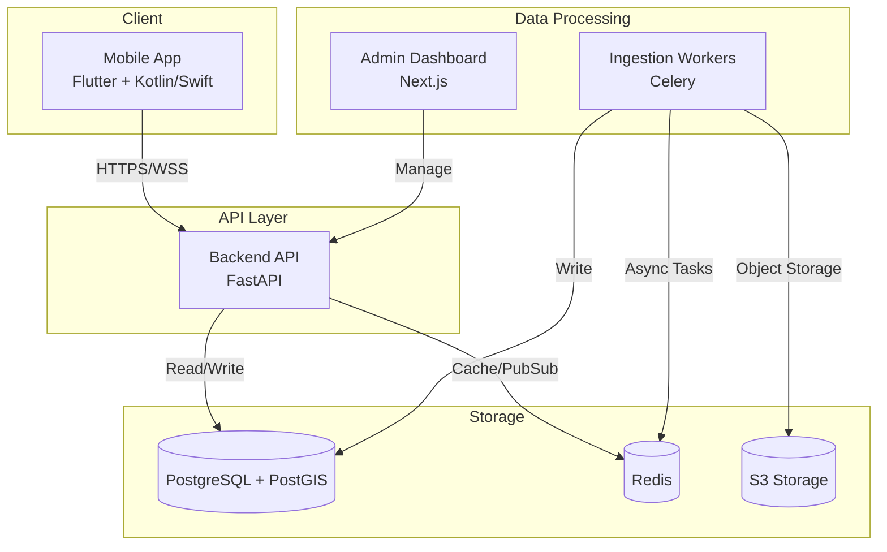

# DriveGuard V3 System Architecture

## System Overview
DriveGuard V3 is a production-grade India-first navigation, traffic-compliance, and enforcement intelligence platform.

## Component Responsibilities
- **Mobile App**: Navigation interface, offline caching, sensor data collection.
- **Backend API**: REST API for mobile clients, route validation, compliance checks.
- **PostgreSQL + PostGIS**: Source of truth, geospatial queries.
- **Redis**: Caching, Job broker, rate limiting.
- **Admin Dashboard**: Data moderation, user management, metrics.
- **Ingestion Workers**: Asynchronous tasks, provider data syncing, heavy geospatial calculations.
- **S3 Storage**: Blob storage for images, exports, logs.

## Data Flow
Client requests route -> API queries provider -> API validates against compliance data -> API returns augmented route to Client.

## Deployment Architecture
Dockerized services deployed via Terraform to AWS/GCP (TBD).
